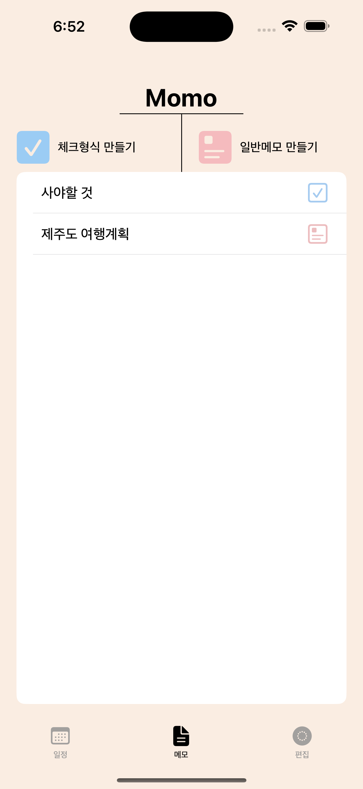
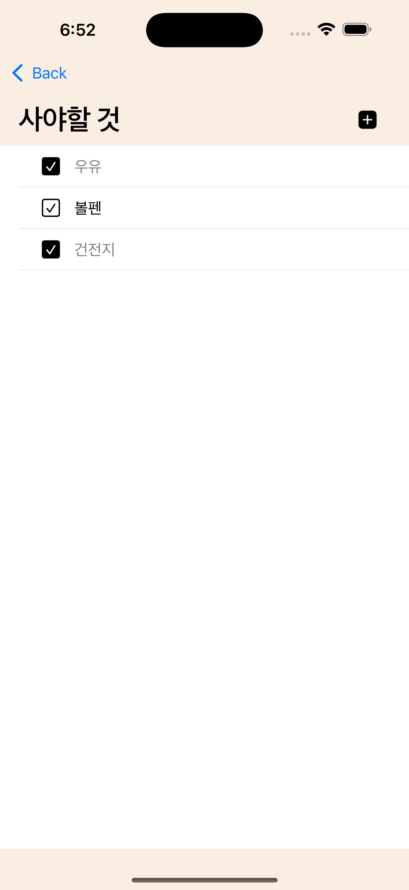

# 🗓️ 아마두 (Amadoo)

> **일정과 메모를 한 곳에서 관리하는 스마트 캘린더**

   

<p align="center">
  
  
  
</p>

<p align="center">
  
  
  
</p>

## 📖 프로젝트 소개

아마두는 **일정 관리**와 **메모 관리**를 하나로 통합한 iOS 캘린더 앱입니다.  
커스터마이징 가능한 일정 색상과 체크리스트 기능으로 개인화된 일정 관리 경험을 제공합니다.

### 💡 개발 배경

- **v1.0 → v1.4.1 리뉴얼**: 초기 학습용 프로젝트를 1년 후 완전히 재구현
- **실사용자 피드백 기반 개선**: App Store 배포 후 4회 업데이트
- **기술 스택 업그레이드**: MVC → MVVM, 하드코딩 → CoreData

---

## ✨ 주요 기능

| 기능 | 설명 |
|------|------|
| 📅 **커스텀 일정 관리** | 원하는 색상으로 일정을 달력에 직관적으로 표시 |
| ✏️ **일정 수정** | 등록된 일정을 언제든지 자유롭게 수정 가능 |
| ✅ **이중 메모 시스템** | 체크리스트형 + 일반형 메모를 하나의 앱에서 관리 |
| 🔔 **스마트 알림** | 매일 아침 당일 일정을 자동으로 알림 제공 |

---

## 🛠 Tech Stack

### **Core Technologies**
- **Swift** - iOS 네이티브 개발
- **UIKit** - Storyboard + Code 기반 UI
- **Auto Layout** - 반응형 UI 구현

### **Architecture & Patterns**
- **MVVM** - View와 비즈니스 로직 분리
- **CoreData** - 로컬 데이터 영구 저장

### **Key Features**
- **Multi-Entity Management** - CheckList, Memo, Schedule 등 다중 Entity 활용
- **Custom Calendar Cell** - 코드 기반 복잡한 캘린더 셀 렌더링
- **Dynamic Data Binding** - 실시간 데이터 변경 반영

---

## 🎯 기술적 도전과 해결

### 1️⃣ **달력 UI 유연성 확보**

**배경**  
사용자별 다양한 UI 요구사항 대응 필요

**문제**  
- Storyboard 기반 개발의 한계점 직면
- 디자인 변경 시마다 Storyboard 수정 필요
- 사용자 피드백 빠른 반영 어려움

**해결**
```swift
// Storyboard → 코드 기반 Custom Cell로 전환
class CalendarCell: UICollectionViewCell {
    // 동적으로 일정을 배치하는 StackView
    private let dutyStackView = UIStackView()
    
    func configure(with events: [...]) {
        // 런타임에 UI 구성 변경 가능
        dutyStackView.arrangedSubviews.forEach { $0.removeFromSuperview() }
        // 일정 충돌 방지 알고리즘 적용
        // ...
    }
}
```

**성과**  
✅ 사용자 요청 반영 속도 대폭 개선  
✅ UI 커스터마이징 자유도 향상

---

### 2️⃣ **복잡한 데이터 구조 단순화**

**배경**  
체크리스트와 일반 메모의 서로 다른 특성

**문제**  
- 초기: CheckList와 Memo 두 개의 Entity 사용
- 코드 복잡성 증가 및 중복 로직 발생
- 데이터 통합 관리의 어려움

**해결**
```swift
// 두 Entity를 하나로 통합하여 관리
private func fetchAndCombineData() {
    let checkListItems = try context.fetch(checkListFetch)
    let memoItems = try context.fetch(memoFetch)
    
    // Dictionary로 제목별 그룹화
    combinedItems = [:]
    
    for item in checkListItems {
        let key = item.title ?? "Untitled"
        combinedItems[key]?.append(item)
    }
    
    for item in memoItems {
        let key = item.title ?? "Untitled"
        combinedItems[key]?.append(item)
    }
}
```

**성과**  
✅ 코드 가독성 향상  
✅ 유지보수성 개선  
✅ 단일 데이터 소스로 통합 관리

---

### 3️⃣ **알림 시스템 신뢰성 확보**

**배경**  
사용자의 일정 놓침 방지가 핵심 가치

**문제**  
- v1.4 초기: 새벽 시간 앱 실행 시 당일 알림 누락
- 사용자 신뢰도 하락 위험

**해결**
```swift
// 시간 조건부 알림 로직 구현
func scheduleNotifications() {
    let now = Date()
    let calendar = Calendar.current
    
    // 현재 시간이 새벽이면 당일 알림도 포함
    if calendar.component(.hour, from: now) < 6 {
        // 당일 일정 알림 추가
        scheduleNotificationForToday()
    }
    
    // 다음 날 알림 스케줄링
    scheduleNotificationForTomorrow()
}
```

**성과**  
✅ v1.4.1에서 알림 신뢰도 100% 달성  
✅ 사용자 불만 제로화

---

## 🔄 버전 히스토리

### 💡 핵심 가치
- **사용자 중심 개발**: 단순한 기능 구현을 넘어 실제 사용자의 문제를 해결
- **지속적 개선**: 5회 연속 업데이트로 입증된 피드백 반영 역량
- **완성도 높은 실행력**: 개인 프로젝트를 실제 서비스 수준으로 완성

---

### v1.4.1 (Latest) - 안정성 개선
**문제**  
새벽 시간대 앱 실행 시 당일 알림 누락 발생

**해결**  
시간 조건부 로직으로 완전 해결

**결과**  
✅ 알림 신뢰도 100% 달성

---

### v1.4 - 알림 시스템
**추가 기능**  
매일 아침 일정 알림 기능 구현

**기술 스택**  
UserNotifications 프레임워크 활용

---

### v1.3 - 핵심 기능 확장
**사용자 요청**  
일정 편집 기능 추가 (요청 1순위)

**기술 구현**  
- CoreData 수정 로직 구현
- View 재활용으로 코드 효율성 증대

---

### v1.2 - 편의성 강화
**추가 기능**  
카테고리 즉시 생성 기능

**기술 구현**  
- View 재활용 패턴
- Delegate 패턴 활용

---

### v1.1 - 사용성 개선
**문제**  
일정 등록 과정이 복잡하다는 사용자 피드백

**해결**  
일정 추가 단계 50% 단축

**결과**  
✅ 사용자 만족도 향상

---

### v1.0.0 - 초기 출시
- 기본 캘린더 기능
- 일정 추가/삭제
- 메모 관리 기능

---

## 💭 회고 (Retrospective)

### 잘한 점 ✅
- **실사용자 중심 개발**: App Store 배포 후 5회 연속 업데이트로 실제 사용자 문제 해결
- **기술적 성장**: Storyboard → 코드 기반 UI로 전환하며 유연성 확보
- **완성도 높은 실행력**: 알림 신뢰도 100% 달성 등 실제 서비스 수준 완성
- **체계적 문제 해결**: 각 버전마다 명확한 문제 정의 → 해결 → 검증 프로세스

### 아쉬운 점 📝
- Storyboard 중심 개발로 협업 시 충돌 가능성
- 테스트 코드 부재로 리팩토링 시 불안감
- 다중 디바이스 동기화 미지원

### 다음 프로젝트에 적용할 점 🎯
- SwiftUI로 전환하여 선언형 UI 경험
- Unit Test 도입으로 안정성 강화
- CloudKit 연동으로 멀티 디바이스 동기화
- Widget 기능 추가로 접근성 향상

---

## 🔗 Links

- **GitHub Repository**: [simoni-git/Amadoo_-Official_Code](https://github.com/simoni-git/Amadoo_-Official_Code)
- **App Store**: [다운로드 링크 추가]

---

## 👤 Author

**고민수 (Minsu Go)**
- 📧 Email: gms5889@naver.com
- 💼 GitHub: [@simoni-git](https://github.com/simoni-git)
- 📝 Blog: [네이버 블로그](https://blog.naver.com/gms5889)

---


